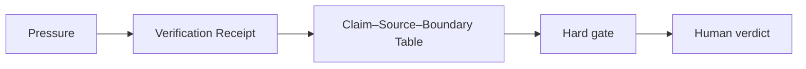

# AI Client Memo Verification for Consultants

## Situation

The memo reads well, but the consultant must know which claims are sourced, which are assumptions, and which require client-specific verification.

## Guided synapse

- Active operation: [[Verification Receipt]]
- Native artefact: [[Claim–Source–Boundary Table]]
- Gate: No client-facing recommendation is release-ready without claim extraction, source path, boundary, and consequence review.
- Human verdict: The consultant decides what is safe to send, what must be caveated, and what requires further evidence.

## Prompt

> Route this client memo through the Verification Receipt. Extract recommendations, factual claims, numerical claims, source paths, assumptions, boundaries, and trust labels.

## Related

- [[Human Verdict]]
- [[Receipt Before Release]]
- [[ChatGPT Project Installation]]
- [[Claude Project Installation]]
- [[Gemini Gem Installation]]
