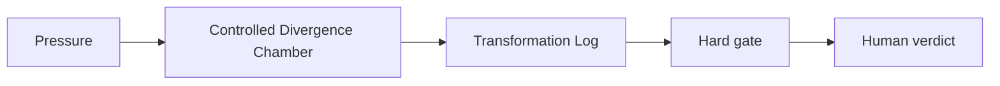

# AI Controlled Divergence for Artists and Creators

## Situation

The artist wants more directions, but generated aesthetics can become borrowed style or decorative noise.

## Guided synapse

- Active operation: [[Controlled Divergence Chamber]]
- Native artefact: [[Transformation Log]]
- Gate: No generated direction becomes the work until it is transformed by taste, material constraint, and human refusal.
- Human verdict: The artist decides what remains alive, what feels cheap, and what must be transformed or refused.

## Prompt

> Run this project through the Controlled Divergence Chamber. Preserve the creative pressure first, generate provisional directions, label what feels alive or cheap, and define a test gate before development.

## Related

- [[Human Verdict]]
- [[Receipt Before Release]]
- [[ChatGPT Project Installation]]
- [[Claude Project Installation]]
- [[Gemini Gem Installation]]
