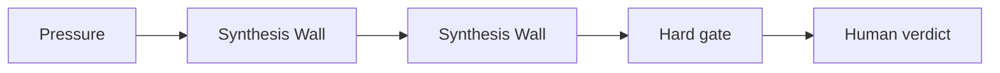

# AI Decision Memo Synthesis for Analysts

## Situation

The analyst has notes, sources, stakeholder constraints, and model output, but the decision memo needs a defensible structure.

## Guided synapse

- Active operation: [[Synthesis Wall]]
- Native artefact: [[Synthesis Wall]]
- Gate: No memo structure is final until evidence, assumptions, contradictions, and decision criteria are separated.
- Human verdict: The analyst decides the recommendation, confidence level, and unresolved risk.

## Prompt

> Create a Synthesis Wall for this decision memo. Sort evidence, assumptions, contradictions, stakeholder constraints, criteria, and human judgments before drafting the memo.

## Related

- [[Human Verdict]]
- [[Receipt Before Release]]
- [[ChatGPT Project Installation]]
- [[Claude Project Installation]]
- [[Gemini Gem Installation]]
