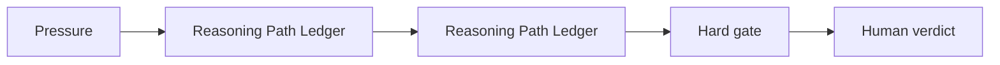

# AI Design Review Reasoning Workflow for Engineers

## Situation

The engineer wants reasoning support, but model fluency must not be mistaken for calculation, standard compliance, or test evidence.

## Guided synapse

- Active operation: [[Reasoning Path Ledger]]
- Native artefact: [[Reasoning Path Ledger]]
- Gate: No technical reasoning path becomes a design conclusion until assumptions, break conditions, calculations, and test needs are recorded.
- Human verdict: The engineer decides what must be calculated, tested, escalated, or rejected.

## Prompt

> Use the Reasoning Path Ledger on this design-review argument. Separate assumptions, causal paths, boundary conditions, calculation needs, test gates, and human engineering decisions.

## Related

- [[Human Verdict]]
- [[Receipt Before Release]]
- [[ChatGPT Project Installation]]
- [[Claude Project Installation]]
- [[Gemini Gem Installation]]
