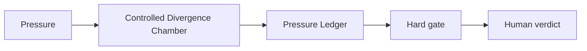

# AI Fiction Co-Writing Without Losing Original Voice

## Situation

The writer needs more possibilities, but generic model suggestions can flatten voice and replace the initial wound of the story.

## Guided synapse

- Active operation: [[Controlled Divergence Chamber]]
- Native artefact: [[Pressure Ledger]]
- Gate: Generated scenes, titles, and plot alternatives remain provisional until the writer selects, rejects, or transforms them through taste and continuity.
- Human verdict: The writer decides what serves the story and what must be refused.

## Prompt

> Use Controlled Divergence for this fiction project. First preserve the story pressure and what must not be cheapened. Then generate alternatives as provisional material, with taste notes and rejection criteria.

## Related

- [[Human Verdict]]
- [[Receipt Before Release]]
- [[ChatGPT Project Installation]]
- [[Claude Project Installation]]
- [[Gemini Gem Installation]]
