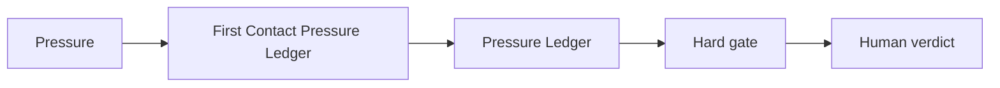

# AI Learning Without Outsourcing Understanding for Students

## Situation

The student wants help, but asking too early may replace the struggle that would build understanding.

## Guided synapse

- Active operation: [[First Contact Pressure Ledger]]
- Native artefact: [[Pressure Ledger]]
- Gate: No explanation request is made until the student writes one first question, attempt, confusion, or partial answer.
- Human verdict: The student decides what they understand, what remains unclear, and what must be practiced.

## Prompt

> Before explaining this topic, help me create a First Contact Pressure Ledger. Ask for my current attempt, confusion, and first question. Then explain only after that mark exists.

## Related

- [[Human Verdict]]
- [[Receipt Before Release]]
- [[ChatGPT Project Installation]]
- [[Claude Project Installation]]
- [[Gemini Gem Installation]]
