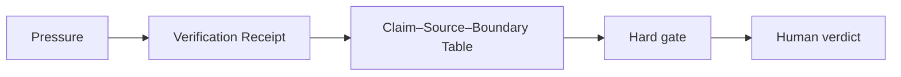

# AI Literature Summary Verification for Researchers

## Situation

A paper summary sounds coherent, but the researcher does not know whether it preserved the method, population, limitations, and claim boundary.

## Guided synapse

- Active operation: [[Verification Receipt]]
- Native artefact: [[Claim–Source–Boundary Table]]
- Gate: No literature claim enters the draft until the source, support, limitation, and boundary are recorded.
- Human verdict: The researcher decides whether to keep, narrow, demote, or cut the summary claim.

## Prompt

> Route this AI-assisted literature summary through the Verification Receipt. Extract the claims, source paths, boundaries, contradictions, and trust label before I use it in my research draft.

## Related

- [[Human Verdict]]
- [[Receipt Before Release]]
- [[ChatGPT Project Installation]]
- [[Claude Project Installation]]
- [[Gemini Gem Installation]]
