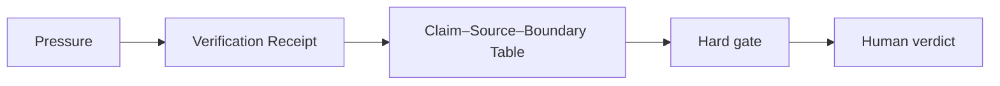

# AI Pitch Deck Claim Verification for Founders

## Situation

A market slide sounds persuasive, but the growth claim may be outdated, unsourced, exaggerated, or too broad.

## Guided synapse

- Active operation: [[Verification Receipt]]
- Native artefact: [[Claim–Source–Boundary Table]]
- Gate: No investor-facing claim leaves without source support, boundary, and consequence check.
- Human verdict: The founder decides whether to keep, narrow, replace, or remove the claim.

## Prompt

> Route this pitch-deck claim through the Verification Receipt. Extract the factual, numerical, and market claims; identify source paths; add boundaries; search for contradiction; and assign a trust label.

## Related

- [[Human Verdict]]
- [[Receipt Before Release]]
- [[ChatGPT Project Installation]]
- [[Claude Project Installation]]
- [[Gemini Gem Installation]]
