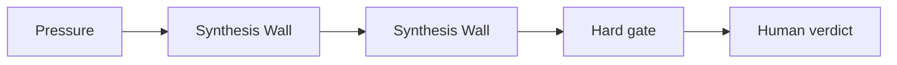

# AI Source-Grounded Lecture Builder for Educators

## Situation

The educator has sources, examples, and a lesson goal, but the lecture needs a defensible structure and clear boundaries.

## Guided synapse

- Active operation: [[Synthesis Wall]]
- Native artefact: [[Synthesis Wall]]
- Gate: No lecture structure is accepted until source claims, examples, boundaries, and teaching judgments are placed separately.
- Human verdict: The educator decides the sequence, emphasis, and final teaching claim.

## Prompt

> Build a Synthesis Wall for this lecture. Sort source claims, examples, boundaries, contradictions, and human teaching judgments before creating the lecture structure.

## Related

- [[Human Verdict]]
- [[Receipt Before Release]]
- [[ChatGPT Project Installation]]
- [[Claude Project Installation]]
- [[Gemini Gem Installation]]
