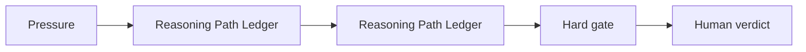

# AI Startup Screening Workflow for Angel Investors

## Situation

The model can reorganize a pitch deck quickly, but the investor must not outsource judgment about risk, evidence, or conviction.

## Guided synapse

- Active operation: [[Reasoning Path Ledger]]
- Native artefact: [[Reasoning Path Ledger]]
- Gate: No model-generated investment conclusion becomes a decision until its premises, break conditions, and verification needs are recorded.
- Human verdict: The investor decides which questions to ask, which claims to verify, and whether the opportunity deserves time.

## Prompt

> Analyze this pitch as reasoning paths, not a verdict. Separate causal, market, team, moat, and traction assumptions. Record break conditions and verification needs before any investment judgment.

## Related

- [[Human Verdict]]
- [[Receipt Before Release]]
- [[ChatGPT Project Installation]]
- [[Claude Project Installation]]
- [[Gemini Gem Installation]]
